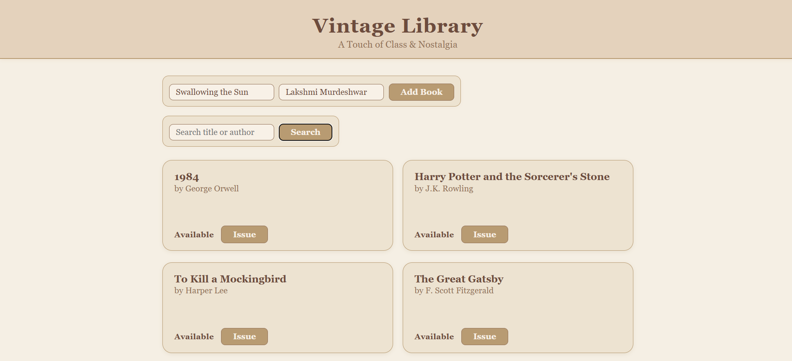

# Vintage Library – Array-Based Book Management System

**Vintage Library** is a simple, array-based library management system built using HTML, CSS, and JavaScript. It allows users to store book details in arrays, perform searches (by title or author), and manage issue/return operations with a clean vintage-themed UI.

## Features

- **Add New Books**
  - Enter book title and author to add to the library.
  - Automatically displayed in the main book grid.

- **Search Functionality**
  - Search books by title or author.
  - Displays only the matching results.

- **Issue/Return System**
  - Toggle between "Available" and "Issued" status for each book.
  - Keeps the library inventory up to date.

- **Responsive UI**
  - Vintage-style theme with CSS.
  - Works on both desktop and mobile screens.

## Tech Stack

- **Frontend:** HTML5, CSS3
- **Logic & Functionality:** Vanilla JavaScript (Array-based storage)
- **No Backend Required:** All data is stored in arrays in the browser.

## Getting Started

1. Clone the repository
```bash
git clone https://github.com/your-username/VintageLibrary.git
cd VintageLibrary
Run the project
```
- Simply open the index.html file in any browser.
- No server or additional setup is required.

## Project Structure
```bash
VintageLibrary/
├── index.html        # Main UI for the library
├── style.css         # Styling for the vintage theme
├── script.js         # Core logic: arrays, search, issue/return, add book
├── screenshots/      # Folder for UI screenshots
└── README.md         # Project documentation
```

## Screenshots

1. Home Page – Vintage Library header and empty book grid


2. Adding a Book – Entering book details in the Add Book form


3. Search Functionality – Searching books by title or author


4. Issue/Return – Marking a book as issued and then returning it


## Future Improvements

- Persistent storage using localStorage or a backend database.
- Categories and genres for books.
- User authentication with role-based access (Librarian/Reader).
- Option to export library data as CSV/JSON.

##
## - Coded by Abhishek Karthik, Mahi Shukla